# Projeto para a disciplina "Arquitetura Java" da Pós-Graduação "MIT em Arquitetura de Software" da Infnet

Esta é a primeira entrega do projeto em Spring. 

Trata-se de uma API básica para registrar as despesas que pilotos possuem com suas motocicletas.
Os dados são carregados de um arquivo CSV.

## Tecnologias Utilizadas

- Java 17
- Spring Boot 3.3.4
- Maven

## Arquitetura
O projeto utiliza a Arquitetura Hexagonal.

## Como Executar

> mvn clean install
>
> mvn spring-boot:run

## Endpoints

- "/historico"
  - Lista todos os históricos de despesas cadastrados.

## Diagrama de Classes UML

```mermaid
classDiagram
direction BT
class Abastecimento {
  + toString() String
   float litrosAbastecidos
   String tipoCombustivel
   Endereco endereco
}
class AbastecimentoLoader {
  + load() void
}
class AbastecimentoRepository {
<<Interface>>
  + contarTodos() Long
  + buscarPorId(int) Optional~Abastecimento~
  + salvar(Abastecimento) Abastecimento
  + obterTodos(Sort) List~Abastecimento~
  + obterPorValor(float, float) List~Abastecimento~
}
class AbastecimentoRepositoryImpl {
  + contarTodos() Long
  + salvar(Abastecimento) Abastecimento
  + obterTodos(Sort) List~Abastecimento~
  + obterPorValor(float, float) List~Abastecimento~
  + buscarPorId(int) Optional~Abastecimento~
}
class AbastecimentosResponse {
   Long total
   List~Abastecimento~ abastecimentos
}
class AlterarAbastecimento {
  + alterar(int, Abastecimento) Abastecimento
}
class AlterarAbastecimentoController {
  + alterar(int, Abastecimento) ResponseEntity~Abastecimento~
}
class AlterarManutencao {
  + alterar(int, Manutencao) Manutencao
}
class AlterarManutencaoController {
  + alterar(int, Manutencao) ResponseEntity~Manutencao~
}
class AlterarMoto {
  + alterar(int, Moto) Moto
}
class AlterarMotoController {
  + alterar(int, Moto) ResponseEntity~Moto~
}
class AppDataLoader {
  + run(ApplicationArguments) void
}
class Application {
  + main(String[]) void
  + corsConfigurer() WebMvcConfigurer
}
class ApplicationTests {
  ~ contextLoads() void
}
class Despesa {
  + toString() String
   LocalDate data
   float valor
   int id
}
class DespesasResponse {
   Long total
   List~Despesa~ despesas
}
class Endereco {
  + toString() String
   int id
   String localidade
   String cep
   String uf
   String complemento
   String bairro
   String logradouro
}
class EnderecoClient {
<<Interface>>
  + findByCep(String) Endereco
}
class EntidadeNaoEncontradaException
class EntityLoader {
<<Interface>>
  + load() void
}
class ExcluirAbastecimento {
  + excluirAbastecimento(int) void
}
class ExcluirAbastecimentoController {
  + excluir(Integer) ResponseEntity~String~
}
class ExcluirManutencao {
  + excluirManutencao(int) void
}
class ExcluirManutencaoController {
  + excluir(Integer) ResponseEntity~String~
}
class ExcluirMoto {
  + excluirMoto(int) void
}
class ExcluirMotoController {
  + excluir(Integer) ResponseEntity~String~
}
class FeignEnderecoClient {
<<Interface>>
  + findByCep(String) Endereco
}
class FeignEnderecoClientImpl {
  + findByCep(String) Endereco
}
class GlobalExceptionHandler {
  + handleValidationExceptions(MethodArgumentNotValidException) ResponseEntity~Map~String, String~~
  + handleValidationExceptions(EntidadeNaoEncontradaException) ResponseEntity~Object~
  + handleFeignExceptions(FeignException) ResponseEntity~Object~
}
class Historico {
  + adicionarDespesa(Despesa) void
  + toString() String
  + removerDespesa(int) void
   Moto moto
   boolean ativo
   LocalDate dataCriacao
   int id
   List~Despesa~ despesas
}
class HistoricoRepository {
<<Interface>>
  + obterPorMotoId(int) Optional~Historico~
  + remover(int) void
  + obterPorDespesaId(int) Optional~Historico~
  + obterTodos(Sort) List~Historico~
  + contarTodos() Long
  + salvar(Historico) Historico
}
class HistoricoRepositoryImpl {
  + salvar(Historico) Historico
  + obterPorDespesaId(int) Optional~Historico~
  + contarTodos() Long
  + remover(int) void
  + obterPorMotoId(int) Optional~Historico~
  + obterTodos(Sort) List~Historico~
}
class HistoricosResponse {
   Long total
   List~Historico~ historicos
}
class IncluirAbastecimento {
  + incluir(int, Abastecimento) void
}
class IncluirAbastecimentoController {
  + incluir(int, Abastecimento) ResponseEntity~String~
}
class IncluirManutencao {
  + incluir(int, Manutencao) void
}
class IncluirManutencaoController {
  + incluir(int, Manutencao) ResponseEntity~String~
}
class IncluirMoto {
  + incluir(Moto, LocalDate) void
}
class IncluirMotoController {
  + incluir(Moto) ResponseEntity~String~
}
class LeitorCsv {
  - csvToStringList(String) List~String[]~
  + ler(String) List~String[]~
}
class ListarAbastecimentos {
  + listar(float, float) AbastecimentosResponse
  + listar() AbastecimentosResponse
}
class ListarAbastecimentosController {
  + listar(Float, Float) AbastecimentosResponse
}
class ListarHistoricos {
  + listar() HistoricosResponse
  + listar(int) HistoricosResponse
}
class ListarHistoricosController {
  + listar(Integer) HistoricosResponse
}
class ListarManutencoes {
  + listar() ManutencoesResponse
  + listar(LocalDate, LocalDate) ManutencoesResponse
}
class ListarManutencoesController {
  + listar(LocalDate, LocalDate) ManutencoesResponse
}
class ListarMotos {
  + listar() MotosResponse
  + listar(String) MotosResponse
}
class ListarMotosController {
  + listar(String) MotosResponse
}
class Manutencao {
  + toString() String
   String observacoes
   String tipo
}
class ManutencaoLoader {
  + load() void
}
class ManutencaoRepository {
<<Interface>>
  + salvar(Manutencao) Manutencao
  + contarTodos() Long
  + obterTodos(Sort) List~Manutencao~
  + obterPorPeriodo(LocalDate, LocalDate) List~Manutencao~
  + buscarPorId(int) Optional~Manutencao~
}
class ManutencaoRepositoryImpl {
  + salvar(Manutencao) Manutencao
  + obterTodos(Sort) List~Manutencao~
  + obterPorPeriodo(LocalDate, LocalDate) List~Manutencao~
  + buscarPorId(int) Optional~Manutencao~
  + contarTodos() Long
}
class ManutencoesResponse {
   List~Manutencao~ manutencoes
   Long total
}
class Moto {
  + toString() String
   int id
   String marca
   String modelo
}
class MotoLoader {
  + load() void
}
class MotoRepository {
<<Interface>>
  + buscarPorId(int) Optional~Moto~
  + remover(int) void
  + obterTodos(Sort) List~Moto~
  + obterPorMarca(String) List~Moto~
  + contarTodos() Long
  + salvar(Moto) Moto
}
class MotoRepositoryImpl {
  + obterPorMarca(String) List~Moto~
  + remover(int) void
  + buscarPorId(int) Optional~Moto~
  + contarTodos() Long
  + salvar(Moto) Moto
  + obterTodos(Sort) List~Moto~
}
class MotosResponse {
   Long total
   List~Moto~ motos
}
class SalvarHistorico {
  + salvar(Historico) void
}
class SpringDataAbastecimentoRepository {
<<Interface>>
  + findAllByValorBetween(float, float) List~Abastecimento~
}
class SpringDataHistoricoRepository {
<<Interface>>
  + findByMotoId(Integer) Optional~Historico~
  + findByDespesasId(int) Optional~Historico~
}
class SpringDataManutencaoRepository {
<<Interface>>
  + findAllByDataBetween(LocalDate, LocalDate) List~Manutencao~
}
class SpringDataMotoRepository {
<<Interface>>
  + findAllByMarca(String) List~Moto~
}
class SwaggerConfig {
  + customOpenAPI() OpenAPI
}

Abastecimento  -->  Despesa 
Abastecimento "1" *--> "endereco 1" Endereco 
AbastecimentoLoader  ..>  Abastecimento : «create»
AbastecimentoLoader  ..>  Endereco : «create»
AbastecimentoLoader  ..>  EntityLoader 
AbastecimentoLoader "1" *--> "incluirAbastecimento 1" IncluirAbastecimento 
AbastecimentoLoader "1" *--> "leitorCsv 1" LeitorCsv 
AbastecimentoRepositoryImpl  ..>  AbastecimentoRepository 
AbastecimentoRepositoryImpl "1" *--> "springDataAbastecimentoRepository 1" SpringDataAbastecimentoRepository 
AbastecimentosResponse "1" *--> "abastecimentos *" Abastecimento 
AlterarAbastecimento "1" *--> "abastecimentoRepository 1" AbastecimentoRepository 
AlterarAbastecimento "1" *--> "enderecoClient 1" EnderecoClient 
AlterarAbastecimentoController "1" *--> "alterarAbastecimento 1" AlterarAbastecimento 
AlterarManutencao "1" *--> "manutencaoRepository 1" ManutencaoRepository 
AlterarManutencaoController "1" *--> "alterarManutencao 1" AlterarManutencao 
AlterarMoto "1" *--> "motoRepository 1" MotoRepository 
AlterarMotoController "1" *--> "alterarMoto 1" AlterarMoto 
AppDataLoader "1" *--> "entityLoaders *" EntityLoader 
DespesasResponse "1" *--> "despesas *" Despesa 
ExcluirAbastecimento "1" *--> "historicoRepository 1" HistoricoRepository 
ExcluirAbastecimentoController "1" *--> "excluirAbastecimento 1" ExcluirAbastecimento 
ExcluirManutencao "1" *--> "historicoRepository 1" HistoricoRepository 
ExcluirManutencaoController "1" *--> "excluirManutencao 1" ExcluirManutencao 
ExcluirMoto "1" *--> "historicoRepository 1" HistoricoRepository 
ExcluirMoto "1" *--> "motoRepository 1" MotoRepository 
ExcluirMotoController "1" *--> "excluirMoto 1" ExcluirMoto 
FeignEnderecoClientImpl  ..>  EnderecoClient 
FeignEnderecoClientImpl "1" *--> "feignEnderecoClient 1" FeignEnderecoClient 
Historico "1" *--> "despesas *" Despesa 
Historico "1" *--> "moto 1" Moto 
HistoricoRepositoryImpl  ..>  HistoricoRepository 
HistoricoRepositoryImpl "1" *--> "springDataHistoricoRepository 1" SpringDataHistoricoRepository 
HistoricosResponse "1" *--> "historicos *" Historico 
IncluirAbastecimento "1" *--> "enderecoClient 1" EnderecoClient 
IncluirAbastecimento "1" *--> "historicoRepository 1" HistoricoRepository 
IncluirAbastecimentoController "1" *--> "incluirAbastecimento 1" IncluirAbastecimento 
IncluirManutencao "1" *--> "historicoRepository 1" HistoricoRepository 
IncluirManutencaoController "1" *--> "incluirManutencao 1" IncluirManutencao 
IncluirMoto  ..>  Historico : «create»
IncluirMoto "1" *--> "historicoRepository 1" HistoricoRepository 
IncluirMoto "1" *--> "motoRepository 1" MotoRepository 
IncluirMotoController "1" *--> "incluirMoto 1" IncluirMoto 
ListarAbastecimentos "1" *--> "abastecimentoRepository 1" AbastecimentoRepository 
ListarAbastecimentos  ..>  AbastecimentosResponse : «create»
ListarAbastecimentosController "1" *--> "listarAbastecimentos 1" ListarAbastecimentos 
ListarHistoricos "1" *--> "historicoRepository 1" HistoricoRepository 
ListarHistoricos  ..>  HistoricosResponse : «create»
ListarHistoricosController "1" *--> "listarHistoricos 1" ListarHistoricos 
ListarManutencoes "1" *--> "manutencaoRepository 1" ManutencaoRepository 
ListarManutencoes  ..>  ManutencoesResponse : «create»
ListarManutencoesController "1" *--> "listarManutencoes 1" ListarManutencoes 
ListarMotos "1" *--> "motoRepository 1" MotoRepository 
ListarMotos  ..>  MotosResponse : «create»
ListarMotosController "1" *--> "listarMotos 1" ListarMotos 
Manutencao  -->  Despesa 
ManutencaoLoader  ..>  EntityLoader 
ManutencaoLoader "1" *--> "incluirManutencao 1" IncluirManutencao 
ManutencaoLoader "1" *--> "leitorCsv 1" LeitorCsv 
ManutencaoLoader  ..>  Manutencao : «create»
ManutencaoRepositoryImpl  ..>  ManutencaoRepository 
ManutencaoRepositoryImpl "1" *--> "springDataManutencaoRepository 1" SpringDataManutencaoRepository 
ManutencoesResponse "1" *--> "manutencoes *" Manutencao 
MotoLoader  ..>  EntityLoader 
MotoLoader "1" *--> "incluirMoto 1" IncluirMoto 
MotoLoader "1" *--> "leitorCsv 1" LeitorCsv 
MotoLoader  ..>  Moto : «create»
MotoRepositoryImpl  ..>  MotoRepository 
MotoRepositoryImpl "1" *--> "springDataMotoRepository 1" SpringDataMotoRepository 
MotosResponse "1" *--> "motos *" Moto 
SalvarHistorico "1" *--> "historicoRepository 1" HistoricoRepository 
```

